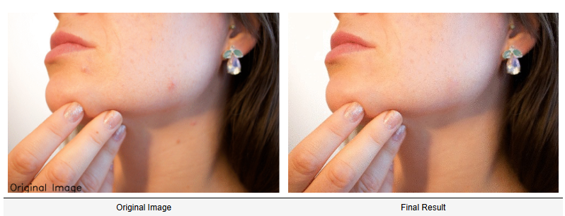

# Blemish Removal

This project is a Python-based image processing tool that removes blemishes from images using a technique called **seamless cloning**. The tool uses OpenCV to interact with the image, allowing users to select blemishes and replace them with smoother regions from the surrounding area.

---

## Features
- **Blemish Removal**: Select blemishes on the image by clicking with the left mouse button, and the tool will remove them by replacing them with a smooth region.
- **Undo Functionality**: Right-click to undo the blemish removal.
- **Smoothness Calculation**: The tool finds the smoothest region around a blemish using Sobel derivatives, which measure the roughness of different regions in the image.

---

## How It Works
1. **Sobel Calculation**: Sobel filters are applied to the image to calculate the roughness of a region. The smoothest region (least edge intensity) is identified as the candidate for replacing the blemish.
2. **Seamless Cloning**: Once a region is selected, the tool seamlessly clones the smoothest region over the blemish area.
3. **Undo and Save**: You can undo the last operation and save the modified image.

---

### Usage
1.**Run the script:**
`python blemish_remover.py`

2. **Interact with the Image:**
-   **Left-click** on the blemish to remove it. The smoothest region from the surrounding area will be cloned over the blemish.
-   **Right-click** to undo the last blemish removal.
-   Press **'s'** to save the edited image as blemish-removed.jpg.
-   Press **ESC** to exit the program.

3.**Image File:** 
 
---

